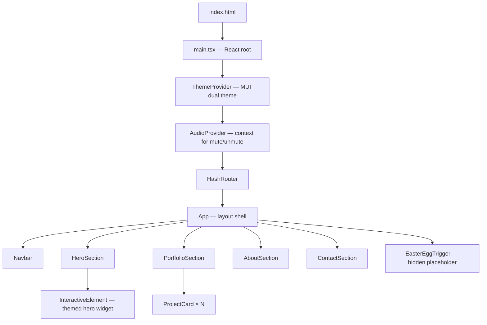

# Design Document: Personal Website SPA

## Overview

A single-page application personal website that blends mechanical keyboards and cooking into a cohesive portfolio experience. Built with React and Material UI (MUI), the site presents the owner's projects, background, and contact information through a themed, interactive interface.

The site is desktop-first but fully responsive down to 320px. Navigation is client-side only (no server round-trips). Audio feedback is opt-in and contextual — keyboard sections play click sounds, cooking sections play sizzle/ambient sounds. A hidden easter egg game is scaffolded as a placeholder for post-prototype implementation.

### Key Design Decisions

- **React + MUI**: MUI provides a robust component system with theming support via `ThemeProvider`. Custom MUI theme tokens encode the dual keyboard/cooking aesthetic.
- **Hash-based routing**: `react-router-dom` with `HashRouter` avoids server configuration requirements for static hosting (GitHub Pages, Netlify, etc.).
- **Inline card expansion**: Project cards expand in-place using MUI `Collapse` + CSS transitions rather than modals, keeping the visitor in context.
- **Audio via Web Audio API / `<audio>` elements**: Sounds are loaded lazily and only triggered by explicit user interaction, satisfying autoplay policy requirements.
- **No form backend**: Contact is a `mailto:` link only.

---

## Architecture

The application is a standard React SPA with a flat component hierarchy. There is no server-side rendering.



### Data Flow

- Project data lives in a static TypeScript file (`src/data/projects.ts`). No API calls.
- Theme tokens live in `src/theme/index.ts` and are injected via MUI `ThemeProvider`.
- Audio state (muted/unmuted) is managed in a React context (`AudioContext`) so any component can trigger sounds or check mute state.
- Routing state is managed by `react-router-dom`; each section is a named hash route (`#hero`, `#portfolio`, `#about`, `#contact`).

---

## Components and Interfaces

### Navbar

Renders the top navigation bar. On viewports ≥ 768px it shows inline links; below 768px it collapses to a hamburger menu using MUI `Drawer`.

```ts
interface NavbarProps {
  sections: { id: string; label: string }[];
}
```

Clicking a link scrolls to the target section via `element.scrollIntoView({ behavior: 'smooth' })` and updates the hash route.

---

### HeroSection

The landing section. Displays owner name, tagline, and a themed `InteractiveElement`. Includes a CTA button that scrolls to `#portfolio`.

```ts
interface HeroSectionProps {
  ownerName: string;
  tagline: string;
}
```

The hero `InteractiveElement` is a keycap widget — a stylized key that depresses on click and plays a click sound if audio is enabled.

---

### PortfolioSection

Renders a responsive grid of `ProjectCard` components. Uses MUI `Grid` with breakpoint-aware column counts (3 cols ≥ 900px, 2 cols ≥ 600px, 1 col < 600px).

```ts
interface PortfolioSectionProps {
  projects: Project[];
}
```

---

### ProjectCard

Displays a project summary. Expands inline on click to show full details. Uses MUI `Card`, `Collapse`, and `CardActions`.

```ts
interface ProjectCardProps {
  project: Project;
}

interface ProjectCardState {
  expanded: boolean;
}
```

Hover triggers a themed lift animation (CSS `transform: translateY(-4px)` + box-shadow transition). Click toggles `expanded`. When `expanded`, a `Collapse` reveals the full description, tech stack chips, and optional repo/demo links.

---

### AboutSection

Displays biography text, interests list, and a profile photo or avatar.

```ts
interface AboutSectionProps {
  bio: string;
  interests: string[];
  avatarSrc: string;
}
```

---

### ContactSection

Renders a `mailto:` link and social profile links (GitHub, LinkedIn).

```ts
interface ContactSectionProps {
  email: string;
  profiles: { label: string; url: string; icon: React.ReactNode }[];
}
```

---

### InteractiveElement

A polymorphic themed widget. Accepts a `theme` prop (`'keyboard' | 'cooking'`) and renders the appropriate visual + triggers audio via `AudioContext`.

```ts
interface InteractiveElementProps {
  theme: 'keyboard' | 'cooking';
  label: string;
  onActivate?: () => void;
}
```

Keyboard variant: keycap depression animation + click sound.  
Cooking variant: sizzle/steam animation + sizzle sound.

Falls back gracefully if `prefers-reduced-motion` is set or the animation API is unavailable.

---

### AudioProvider / useAudio

A React context that manages a global mute state and exposes a `playSound(soundId)` function.

```ts
interface AudioContextValue {
  muted: boolean;
  toggleMute: () => void;
  playSound: (soundId: SoundId) => void;
}

type SoundId = 'keyboard-click' | 'cooking-sizzle';
```

Sounds are loaded as `<audio>` elements with `preload="none"` and only fetched on first interaction. `playSound` is a no-op when `muted === true`.

---

### EasterEggTrigger (Placeholder)

A hidden element in the background (e.g., a specific decorative icon). Clicking it activates the easter egg game. Implementation is a stub — renders nothing visible, logs a console message, and is wired to a `TODO` game component.

---

### MUI Theme (`src/theme/index.ts`)

Custom MUI theme with:
- **Primary palette**: Deep charcoal / off-white (keyboard aesthetic)
- **Secondary palette**: Warm amber / terracotta (cooking aesthetic)
- **Typography**: Monospace font for code/keyboard elements; serif or rounded sans for cooking elements
- **Custom component overrides**: `MuiButton`, `MuiCard`, `MuiChip` styled with keycap-inspired border-radius and shadows

---

## Data Models

### Project

```ts
interface Project {
  id: string;                    // unique slug, e.g. "keyboard-configurator"
  title: string;
  shortDescription: string;      // shown in collapsed card (≤ 120 chars)
  fullDescription: string;       // shown when expanded (markdown or plain text)
  technologies: string[];        // e.g. ["React", "TypeScript", "Rust"]
  imageUrl?: string;             // card thumbnail
  repoUrl?: string;              // optional GitHub link
  demoUrl?: string;              // optional live demo link
  theme?: 'keyboard' | 'cooking' | 'neutral'; // drives card accent color
}
```

### NavSection

```ts
interface NavSection {
  id: string;    // matches DOM element id and hash route fragment
  label: string; // display label in navbar
}
```

### SoundId (enum-like union)

```ts
type SoundId = 'keyboard-click' | 'cooking-sizzle';
```

### AudioState

```ts
interface AudioState {
  muted: boolean;
  loadedSounds: Set<SoundId>;
}
```

---

## Correctness Properties

*A property is a characteristic or behavior that should hold true across all valid executions of a system — essentially, a formal statement about what the system should do. Properties serve as the bridge between human-readable specifications and machine-verifiable correctness guarantees.*

### Property 1: URL hash reflects active section

*For any* section navigated to via the Navbar, the browser URL hash should equal the section's id immediately after navigation completes.

**Validates: Requirements 1.4**

---

### Property 2: Browser history navigation restores correct section

*For any* sequence of navigation actions, pressing the browser back button should restore the previously active section, and pressing forward should re-apply the next section in history.

**Validates: Requirements 1.3**

---

### Property 3: Portfolio renders one card per project

*For any* non-empty array of Project objects passed to PortfolioSection, the number of rendered ProjectCard components should equal the length of the projects array.

**Validates: Requirements 3.1**

---

### Property 4: ProjectCard renders required fields

*For any* valid Project object, the rendered ProjectCard should contain the project title, the short description, at least one image or icon element, and all technology labels from the technologies array.

**Validates: Requirements 3.2, 3.3**

---

### Property 5: ProjectCard expand/collapse round-trip

*For any* ProjectCard in its initial collapsed state, clicking it should expand it (revealing full details), and clicking it again should return it to the collapsed state with no visible full details.

**Validates: Requirements 3.4, 3.5**

---

### Property 6: Optional project links render when data is present

*For any* Project object, if `repoUrl` is defined then the rendered ProjectCard should contain an anchor whose `href` equals `repoUrl`; if `demoUrl` is defined then the rendered ProjectCard should contain an anchor whose `href` equals `demoUrl`; if either field is absent, no corresponding link should be rendered.

**Validates: Requirements 3.7, 3.8**

---

### Property 7: Keyboard InteractiveElement triggers keycap animation on click

*For any* InteractiveElement with `theme='keyboard'`, simulating a click should result in the keycap depression animation state being applied to the component.

**Validates: Requirements 5.3**

---

### Property 8: ProjectCard hover triggers themed animation

*For any* ProjectCard, simulating a mouseenter event should result in the hover animation CSS class or style being applied to the card.

**Validates: Requirements 5.2**

---

### Property 9: Audio theme routing

*For any* InteractiveElement with `theme='keyboard'`, clicking it should invoke `playSound('keyboard-click')`; *for any* InteractiveElement with `theme='cooking'`, clicking it should invoke `playSound('cooking-sizzle')`. In both cases, if `muted` is true, `playSound` should be a no-op.

**Validates: Requirements 5.6, 5.7**

---

### Property 10: AboutSection renders all interests

*For any* array of interest strings passed to AboutSection, every string in the array should appear in the rendered output.

**Validates: Requirements 6.2**

---

### Property 11: Contact links render for all provided data

*For any* email string and profiles array passed to ContactSection, the rendered output should contain an anchor with `href='mailto:{email}'` and one anchor per profile whose `href` matches the profile's url.

**Validates: Requirements 7.1, 7.2**

---

### Property 12: No horizontal overflow at any supported viewport width

*For any* viewport width in the range [320, 2560] pixels, the rendered application's `scrollWidth` should not exceed its `clientWidth` (no horizontal overflow).

**Validates: Requirements 8.2**

---

### Property 13: Touch targets meet minimum size on mobile

*For any* button, link, or interactive element rendered at a mobile viewport (width ≤ 768px), its bounding box should have both width ≥ 44px and height ≥ 44px.

**Validates: Requirements 8.6**

---

### Property 14: Below-fold images are lazy-loaded

*For any* `` element that is not within the initial viewport on page load, the element should have the `loading='lazy'` attribute set.

**Validates: Requirements 9.2**

---

### Property 15: All images have non-empty alt text

*For any* `` element rendered anywhere in the application, its `alt` attribute should be present and non-empty.

**Validates: Requirements 10.1**

---

### Property 16: Keyboard-focused InteractiveElement shows focus indicator

*For any* InteractiveElement, simulating keyboard focus (Tab navigation) should result in a visible CSS focus indicator (outline or equivalent) being applied to the element.

**Validates: Requirements 10.4**

---

## Error Handling

### Navigation Errors

- If a hash route does not match any known section id, the app defaults to displaying the Hero section and does not throw.
- If `scrollIntoView` is unavailable (e.g., jsdom in tests), navigation falls back to setting `window.location.hash` directly.

### Audio Errors

- If an audio file fails to load (network error, missing file), `playSound` catches the error silently and logs a warning to the console. The UI remains fully functional.
- If the browser blocks audio playback (autoplay policy), the error is caught and the mute state is set to `true` automatically.

### Image Loading Errors

- All `` elements include an `onError` handler that swaps the `src` to a themed placeholder SVG, ensuring the layout does not break on missing images.

### Animation API Unavailability

- `InteractiveElement` checks for `prefers-reduced-motion` via `window.matchMedia` before applying animations. If the media query matches or the API is unavailable, animations are skipped and the element remains fully functional.

### Project Data Errors

- If the `projects` array is empty, `PortfolioSection` renders an empty-state message ("No projects yet — check back soon!") rather than an empty grid.

---

## Testing Strategy

### Unit Tests (Vitest + React Testing Library)

Focus on specific examples, edge cases, and component contracts:

- **ProjectCard**: renders required fields, expands/collapses on click, renders optional links only when data present, renders empty-state gracefully.
- **Navbar**: renders all section links, collapses to hamburger at < 768px, all links are keyboard-focusable.
- **ContactSection**: renders mailto link with correct email, renders all profile links.
- **AboutSection**: renders bio, interests, and avatar.
- **AudioProvider**: `toggleMute` flips muted state, `playSound` is no-op when muted.
- **InteractiveElement**: renders keyboard and cooking variants, graceful degradation when animation API unavailable.
- **MUI Theme**: snapshot test of theme object to verify palette and typography tokens.

### Property-Based Tests (fast-check)

Use [fast-check](https://github.com/dubzzz/fast-check) for property-based testing. Each test runs a minimum of 100 iterations.

Tag format: `// Feature: personal-website-spa, Property {N}: {property_text}`

- **Property 1** — URL hash reflects active section: generate arbitrary section ids, navigate to each, assert hash matches.
- **Property 2** — History navigation: generate random navigation sequences, assert back/forward restores correct section.
- **Property 3** — Portfolio card count: generate arbitrary Project arrays, assert rendered card count equals array length.
- **Property 4** — ProjectCard required fields: generate arbitrary Project objects, assert title, shortDescription, technologies all appear in rendered output.
- **Property 5** — Expand/collapse round-trip: generate arbitrary Project objects, click to expand, click to collapse, assert back to initial state.
- **Property 6** — Optional links: generate Projects with arbitrary combinations of repoUrl/demoUrl present or absent, assert link presence matches data.
- **Property 7** — Keyboard animation: generate arbitrary keyboard InteractiveElement props, simulate click, assert animation state applied.
- **Property 8** — Hover animation: generate arbitrary Project objects, simulate mouseenter, assert hover class applied.
- **Property 9** — Audio theme routing: generate arbitrary theme values ('keyboard' | 'cooking'), simulate click, assert correct soundId called; assert no-op when muted.
- **Property 10** — AboutSection interests: generate arbitrary string arrays, assert all items appear in rendered output.
- **Property 11** — Contact links: generate arbitrary email strings and profiles arrays, assert all appear as anchors.
- **Property 12** — No horizontal overflow: generate viewport widths in [320, 2560], render app, assert scrollWidth ≤ clientWidth.
- **Property 13** — Touch target size: generate arbitrary interactive elements at mobile viewport, assert bounding box ≥ 44×44px.
- **Property 14** — Lazy loading: generate arbitrary Project arrays with images, assert below-fold images have `loading='lazy'`.
- **Property 15** — Alt text: generate arbitrary Project/content data, render full app, assert all img elements have non-empty alt.
- **Property 16** — Focus indicator: generate arbitrary InteractiveElement props, simulate Tab focus, assert focus indicator CSS is applied.

### Integration / Smoke Tests

- **LCP performance**: Lighthouse CI in the build pipeline, asserting LCP ≤ 2.5s on simulated 4G.
- **No autoplay audio**: render full app without user interaction, assert no `audio.play()` calls occur.
- **Semantic HTML**: render full app, assert `<nav>`, `<main>`, `<section>`, `<article>` elements are present.
- **Color contrast**: compute contrast ratio for primary text/background pairs from MUI theme, assert ≥ 4.5:1.
- **6-card layout**: render PortfolioSection with 6 projects, assert no layout overflow.
- **Mobile breakpoints**: render at 767px and 599px, assert hamburger menu and single-column layout respectively.
